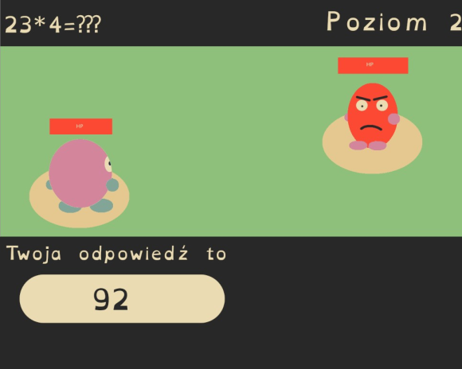
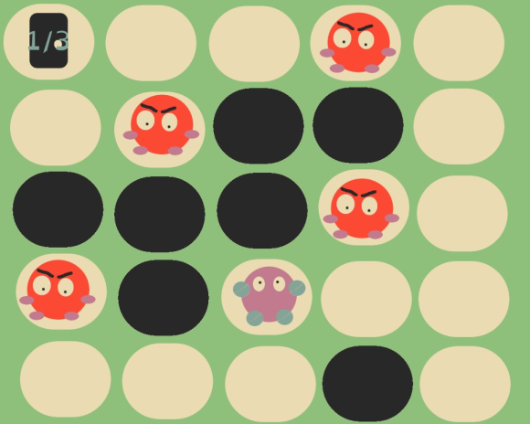

# Projekt JPWP
Prezentacja 2 
Kamil Myćka

---
# Temat projektu:
Interaktywna gra komputerowa w stylu JRPG

# Docelowi użytkownicy gry: 
Dzieci w wieku wczesnoszkolnym, rozpoczynający swoja naukę matematyki, oraz ludzie pragnący
polepszyć swoje zdolności matematyczne.

# Realizacja projektu:
Docelowo projekt zostanie wykonany w technologi Java SDK w środowisku VS Code

---
# Cel projektu:
Celem projektu jest utworzenie prostej gry w stylu JRPG, podana do gier z serii „Pokemon”, w której gracz atakować będzie przeciwników rozwiązując proste równania matematyczne w wyznaczonym czasie. Po wpisaniu poprawnego wyniku przeciwnik otrzyma obrażenia odwrotnie proporcjonalne do czasu który gracz potrzebował na rozwiązanie równania. Poziom trudności będzie wzrastał wraz z czasem trwania walki, oraz poziomem na którym znajduje się gracz. Gra powinna wykształcić w graczu umiejętność szybkiego rozwiązywania równań matematycznych. Gracz poza walką poruszać się będzie po niewielkiej planszy, przypominającej labirynt, na której rozmieszczeni będą wrogowie, oraz przejście na następny poziom, które odblokuje się dopiero po pokonaniu określonej ilości wrogów. Im mniej ruchów zajmie graczowi przejście na następny poziom, tym więcej punktów otrzyma na koniec gry.

---
# Stan wiedzy 
Wśród artykułów można znaleść sporo pozyji traktujących o zastosowaniu poważnych gier w celu rozwoju matematyczego Autorzy artykułu [1] wskazują, że dzięki zwiększeniu zaangażowania i postawienia ucznia przed realnym problemem który należy rozwiązać jesteśmy w stanie zachęcić go do szukania kreatywnych rozwiązań, co rozwiaja jego zdolności logicznego myślenia, a nabyta tym sposobem lekcja zostaje dużo lepiej utrwalona. W [2] zaznaczona jest potrzeba stworzenia gry na tyle ciekawej oraz interesującej, by uczeń chciał do niej wracać i grać w swoim wolnym czasie. Autorzy zaznaczają również potrzebe stworzenia systemu informacji zwrotnej(feedback'u) i nagrody, co wpływa na zaangażowanie gracza. 

---
> Rewards such as extra lives, points, money, ability to unlock special skills and tools, promotion to a new higher level, all help keep a player engaged in game play and are illustrated through comments such as ‘earning new points’, ‘achieving new things’ and ‘being able to play better’. Having a variety of rewards, feedback mechanisms and progression routes can all support a more engaging experience for the player.”

[1] Serious game in science education: How we can develop mathematical education; M. Hosťovecký, I. Šalgovič, Roderik Virágh
[2] Learning Mathematics Through Serious Games: An engagement framework; Opeyemi Dele- Ajayi, Rebecca Strachan, Jonathan Sanderson, Alison Pickard

---
# Wymagania funkcjonalne
* Rozpoczęcie od względnie prostych zadań
* Stopniowe zwiększanie poziomu trudności, wraz z poziomami
* Po włączeniu programu użytkownik znajdzie się w menu, pozwalającym wybrać poziom
* Zadaniem użytkownika jest rozwiązanie równać matematychnych w określonych ramach
czasowych
* Rozwiązywanie kolejnych równać skutkować będzie przejściem na kolejny poziom, ze zwiększonym poziomem trudności
* Gra skończy się w przypadku wielkorotnie błędnie roziązanych równań, a użytkownik poinformowany zostanie o ilości zdobytych punktów, które wynikać będą z czasu spędzonego w grze i ilości poprawnie rozwiązanych równań

---
# Wymagania pozafunkcjonalne
* Gra napisana w Java SE Runtime Environment w wersji 19
* Stałe pole graficzne gry 1280x1024
* Wymagany jest komputer z dowolnym systemem operacyjnym, obsługujący JRE
  
---
# Przebieg gry
* Po włączeniu programu użytkownik może wybrać poziom od którego chce zacząć, po czym rozpoczyna się gra
* Użytkownik porusza się po labiryncie, w którym znajdują się przeciwnicy
* Po wejściu na pole z przeciwnikiem gracz rozpoczyna z nim walkę, w trakcie której wpisać musi roziązanie wygenerowanego losowo równanie matematycznego, po czym wraca on na planszę z labiryntem
* Po pokananiu określonej ilości przeciwników gracz musi przejść przez drzwi, co skutkuje przeniesieniem go na kolejną planszę z większym poziomem trudności

---
* W przypadku przejściu wyszystkich poziomów gracz otrzymuje swoją punktację wraz z
czasem gry.
* Błędne rozwiąznie równań kilka razy pod rząd skutkuje porażką i otrzymaniem
podsumawania gry w postaci punktacji i czasu gry.
* Zarówno po wygranej i porażce gracz zastaje zapytany, czy chce rozpocząć grę od nowa

---
# Grafiki poglądowe

---
