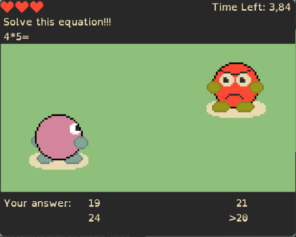
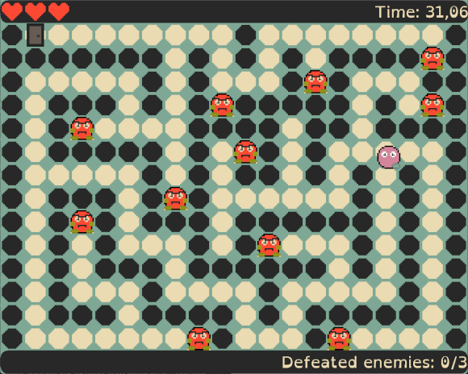
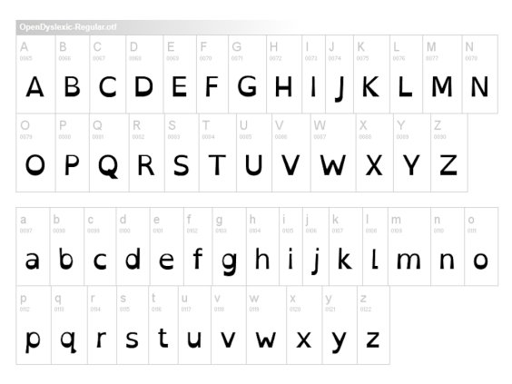
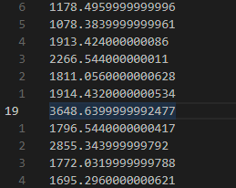
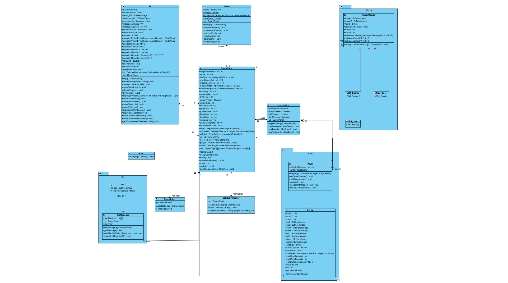

# Projekt JPWP
Prezentacja 3
Kamil Myćka

Link do repozytorium: [serious-game](https://github.com/Mordimmer/serious-game.git)

---

# CELE

## Temat projektu:
Interaktywna gra komputerowa w stylu JRPG

## Cel projektu:
Stworzenie gry komputerowej, w której gracz poruszać będzie się po labiryncie i będzie pokonywał przeciwników, poprzez roziwązywanie prostych równań matematycznych w określonym czasie. 

## Docelowi użytkownicy gry: 
Dzieci w wieku wczesnoszkolnym, rozpoczynający swoja naukę matematyki, oraz ludzie pragnący polepszyć swoje zdolności matematyczne.

---

# Projekt interfejsu graficznego

---

Wczesny zarys interfejsu | Wersja końcowa
:-------------------------:|:-------------------------:
 | 

---

Wczesny zarys interfejsu | Wersja końcowa
:-------------------------:|:-------------------------:
 | 

---

# Zasoby gry

---

## Graficzne

Przód 1 | Przód 2 | Tył 1 | Tył 2 | Lewo 1 | Lewo 2 | Prawo 1 | Prawo 2
:-----:|:------:|:-----:|:-----:|:-----:|:-----:|:------:|:------:
|||||||  

Przeciwnik |Pełne serce | Puste serce | Drzwi | Droga | Kamienna ściana
:-----:|:-----:|:------:|:------:|:------:|:------:
|||||

Gracz w walce | Przeciwnik w walce
:-----:|:-----:
|

Wszystkie grafiki zostały wykone własnoręcznie wykorzystując GNU Image Manipulation Program.


---

## Czcionka

OpenDyslexic


---

# Składowanie danych

Wyniki gracza przechowywane są w pliku /score.txt, co pozwala na łatwe odczytanie ich w każdej chwili zarówno przez rodzica króry chce sprawdzić postęp swojego dziecka, jak i przez samo dziecko.



--- 

# Stan realizacji projektu
1. Zaprojektowano interfejs graficzny gry
2. Zaprojektowano menu gry
3. Zrealizowano wszystkie grafiki, lecz mogą zostać one jeszcze poprawione
4. Zrealizowano wszystkie zaplanowane funkcjonalności

---

# Diagramy klas


---

# Funkcja generująca równanie matematyczne


```java
public void randomEquation() {
        // GENERATING RANDOM NUMBERS FOR THE EQUATION
        equationYIndex = (int) (Math.random() * equationX.length);
        equationXIndex = (int) (Math.random() * equationY.length);
        equationOperatorIndex = (int) (Math.random() * equationOperator.length);
        setAnswer();
        randAns = new double[4];

        // FILL RANDANS WITH RANDOM INTEGER NUMBERS
        for (int i = 0; i < randAns.length; i++) {
            randAns[i] = answer + (int) (Math.random() * (5 + 5)) - 5;
            if (randAns[i] == answer) {
                randAns[i] = answer + (int) (Math.random() * (5 + 5)) - 5;
            }
            for (int j = 0; j < i; j++) {
                if (randAns[i] == randAns[j]) {
                    randAns[i] = answer + (int) (Math.random() * (5 + 5)) - 5;
                }
            }
        }

        // SHUFFLE ARRAY
        randAns[0] = answer;
        for (int i = 0; i < randAns.length; i++) {
            int rand = (int) (Math.random() * randAns.length);
            double temp = randAns[i];
            randAns[i] = randAns[rand];
            randAns[rand] = temp;
        }

        // CHECK IF ANSWERS REPEAT AND SHUFFLE AGAIN
        for (int i = 0; i < randAns.length; i++) {
            for (int j = 0; j < i; j++) {
                if (randAns[i] == randAns[j]) {
                    randAns[j] = answer + (int) (Math.random() * (5 + 5)) - 5;
                }
            }
        }
    }

    // SOLVIN THE EQUATION AND SETTING THE ANSWER
    public void setAnswer() {

        switch (equationOperator[equationOperatorIndex]) {
            case "+":
                answer = equationX[equationXIndex] + equationY[equationYIndex];
                break;
            case "-":
                answer = equationX[equationXIndex] - equationY[equationYIndex];
                break;
            case "*":
                answer = equationX[equationXIndex] * equationY[equationYIndex];
                break;
            case "/":
                if ((double) equationX[equationXIndex] / (double) equationY[equationYIndex] % 1 == 0) {
                    answer = equationX[equationXIndex] / equationY[equationYIndex];
                } else {
                    equationOperatorIndex = 2;
                    answer = (double) equationX[equationXIndex] * (double) equationY[equationYIndex];
                }
                break;
        }
    }
```

---

# Efekt funkcji

