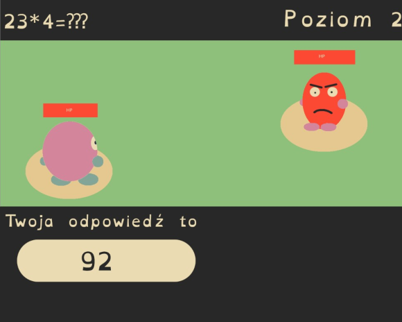
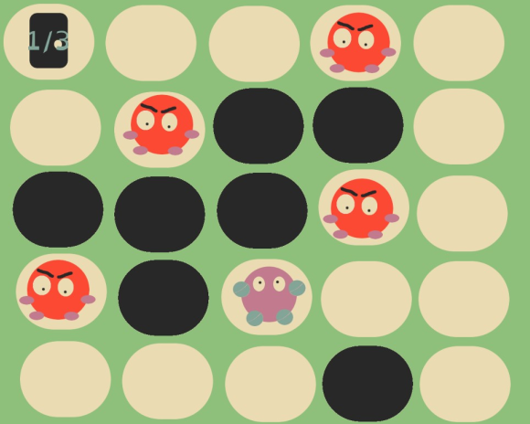
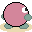
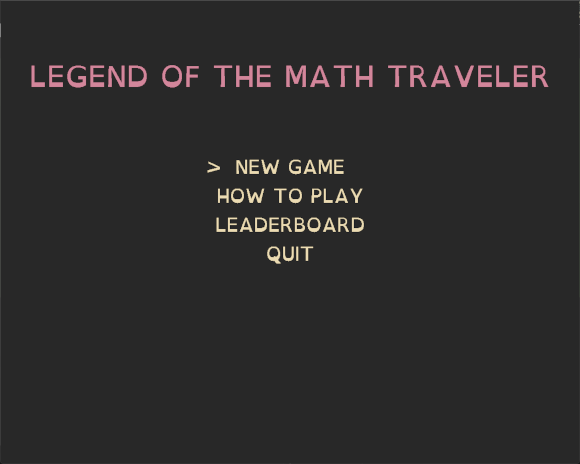

# Projekt JPWP
Prezentacja 3
Kamil Myćka

Link do repozytorium: [serious-game](https://github.com/Mordimmer/serious-game.git)

---

# CELE

## Temat projektu:
Interaktywna gra komputerowa w stylu JRPG

## Cel projektu:
Stworzenie gry komputerowej, w której gracz poruszać będzie się po labiryncie i będzie pokonywał przeciwników, poprzez roziwązywanie prostych równań matematycznych w określonym czasie. 

## Docelowi użytkownicy gry: 
Dzieci w wieku wczesnoszkolnym, rozpoczynający swoja naukę matematyki, oraz ludzie pragnący polepszyć swoje zdolności matematyczne.

---

# Projekt interfejsu graficznego

---

Wczesny zarys interfejsu | Wersja końcowa
:-------------------------:|:-------------------------:
 | 

---

Wczesny zarys interfejsu | Wersja końcowa
:-------------------------:|:-------------------------:
 | 

---

# Zasoby gry

---

## Graficzne

Przód 1 | Przód 2 | Tył 1 | Tył 2 | Lewo 1 | Lewo 2 | Prawo 1 | Prawo 2
:-----:|:------:|:-----:|:-----:|:-----:|:-----:|:------:|:------:
|||||||  

Przeciwnik |Pełne serce | Puste serce | Drzwi | Droga | Kamienna ściana
:-----:|:-----:|:------:|:------:|:------:|:------:
|||||

Gracz w walce | Przeciwnik w walce
:-----:|:-----:
|

Wszystkie grafiki zostały wykone własnoręcznie wykorzystując GNU Image Manipulation Program.


---

## Czcionka

OpenDyslexic


---

# Składowanie danych

Wyniki gracza przechowywane są w pliku /score.txt, co pozwala na łatwe odczytanie ich w każdej chwili zarówno przez rodzica króry chce sprawdzić postęp swojego dziecka, jak i przez samo dziecko.


--- 

# Stan realizacji projektu
1. Zaprojektowano interfejs graficzny gry
2. Zaprojektowano menu gry
3. Zrealizowano wszystkie grafiki, lecz mogą zostać one jeszcze poprawione
4. Zrealizowano wszystkie zaplanowane funkcjonalności

---

# Diagramy klas


---

# Funkcja rysująca ekran początkowy gry


```java
    public void drawTitleScreen() {
        // GAME TITLE
        g2.setColor(new Color(40, 40, 40));
        g2.fillRect(0, 0, gp.screenWidth, gp.screenHeight);
        g2.setFont(OpenDyslexic);
        g2.setFont(g2.getFont().deriveFont(Font.PLAIN, 64F));
        String text = "PLACEHOLDER";
        int x = getXforCenteredText(text);
        int y = gp.tileSize * 3;
        g2.setColor(new Color(211, 134, 155));
        g2.drawString(text, x, y);

        // MENU
        g2.setFont(g2.getFont().deriveFont(Font.PLAIN, 42F));
        text = "NEW GAME";
        x = getXforCenteredText(text);
        y = gp.tileSize * 6;
        g2.setColor(new Color(235, 219, 178));
        g2.drawString(text, x, y);
        if (commandNum == 0) {
            g2.drawString(">", x - gp.tileSize, y);
        }

        text = "HOW TO PLAY";
        x = getXforCenteredText(text);
        y = gp.tileSize * 7;
        g2.drawString(text, x, y);
        if (commandNum == 1) {
            g2.drawString(">", x - gp.tileSize, y);
        }

        text = "LEADERBOARD";
        x = getXforCenteredText(text);
        y = gp.tileSize * 8;
        g2.drawString(text, x, y);
        if (commandNum == 2) {
            g2.drawString(">", x - gp.tileSize, y);
        }

        text = "QUIT";
        x = getXforCenteredText(text);
        y = gp.tileSize * 9;
        g2.drawString(text, x, y);
        if (commandNum == 3) {
            g2.drawString(">", x - gp.tileSize, y);
        }
    }
```

---

# Efekt funkcji

